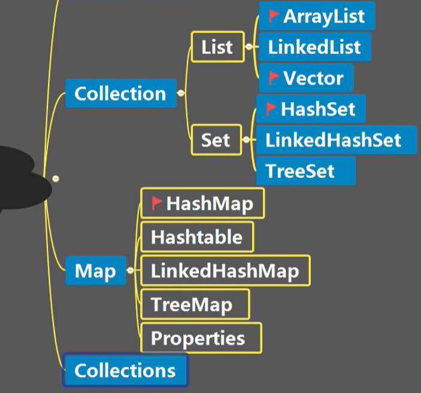
集合框架体系图:
    
    比较重要的几个概念：
    单列（单个值形式）：    
    双列（键值对形式）：    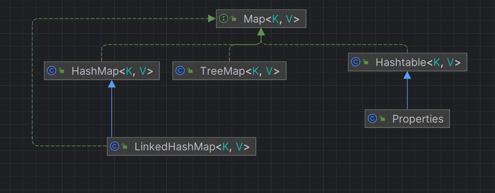
    collection集合下有两个重要的子接口：list、 set，他们的实现子类都是单例子类
    Map的实现子类是双列子类，存放的是key 和value；
  
一、Collection接口和常用方法：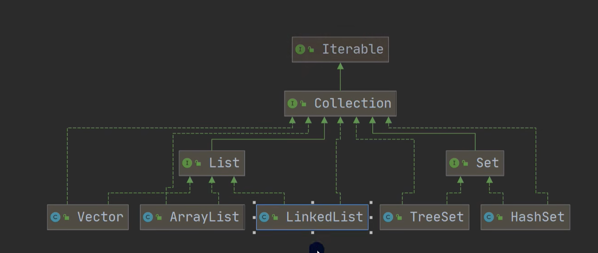
                          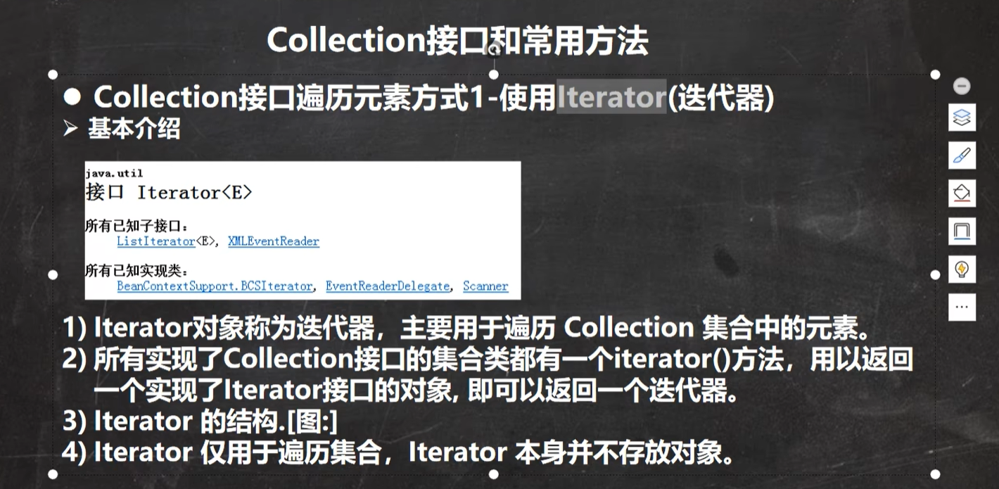
                1、迭代器的执行原理：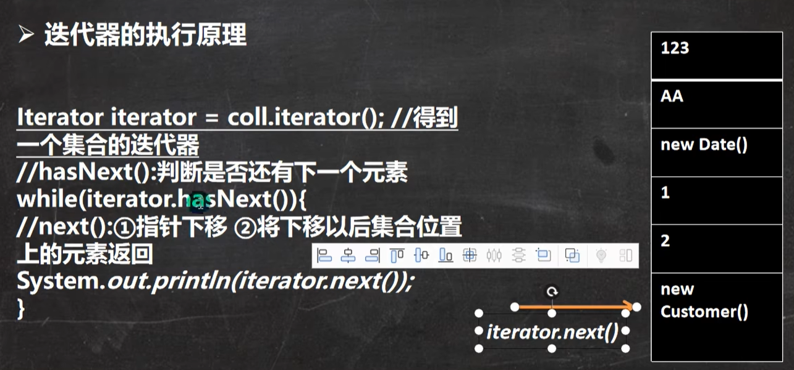
                2、for循环增强：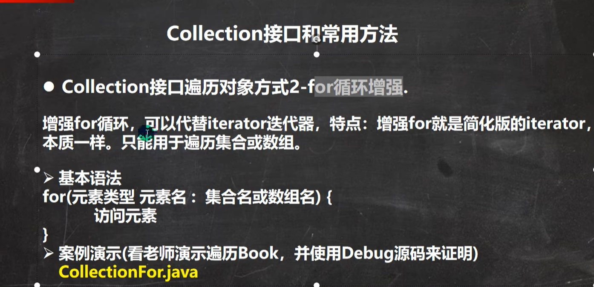
                
作业：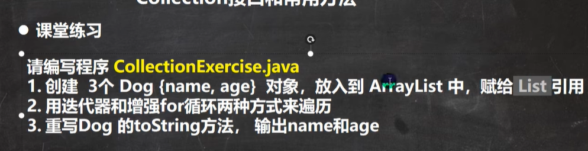:见包collection/homework;

list相关：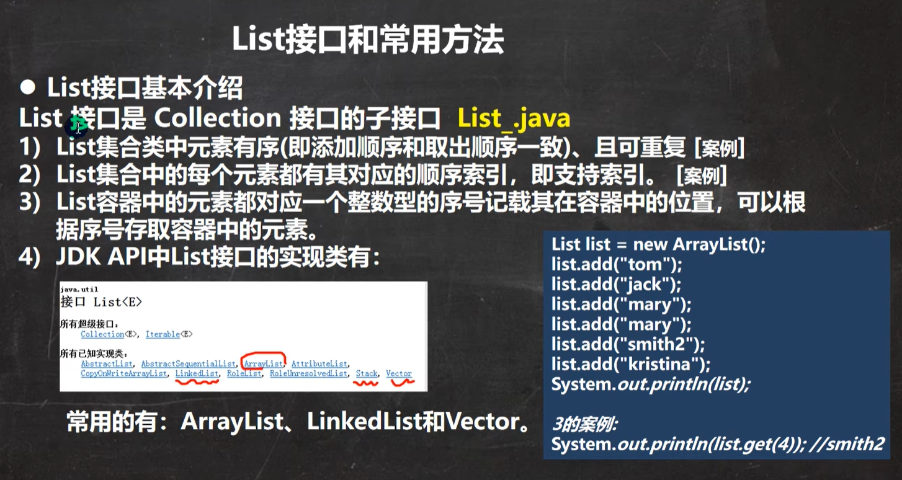
         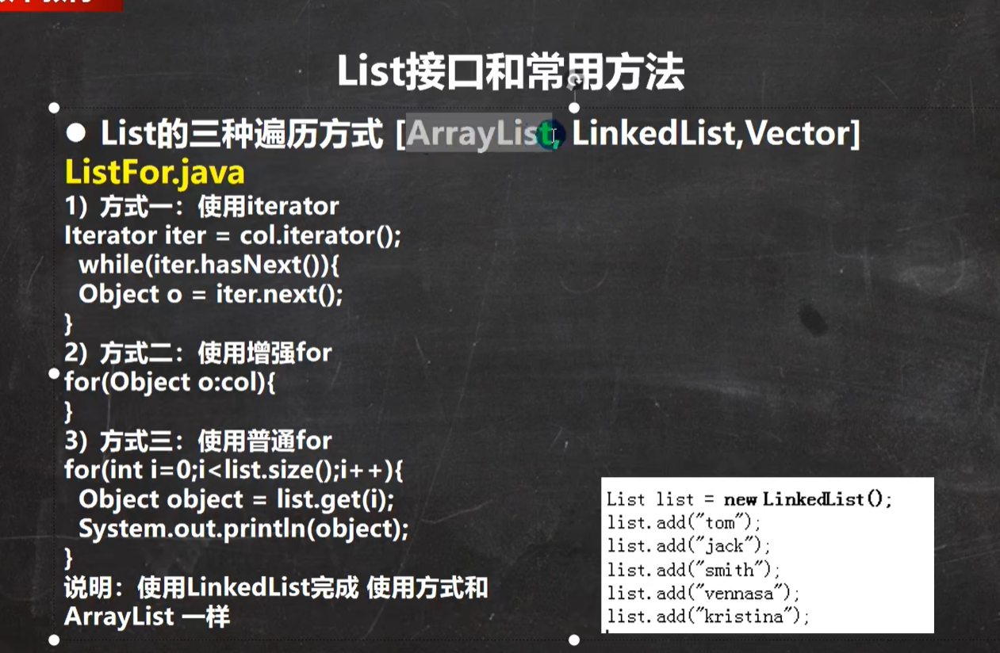
    作业：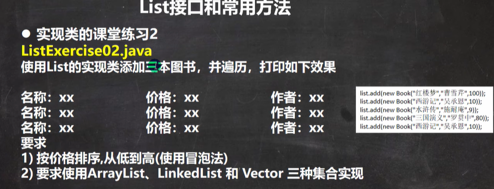

作业 ：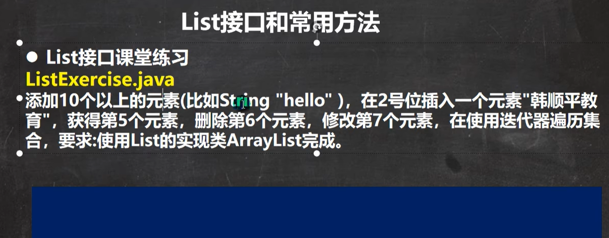

ArrayL: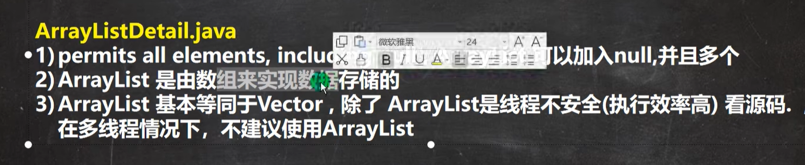
        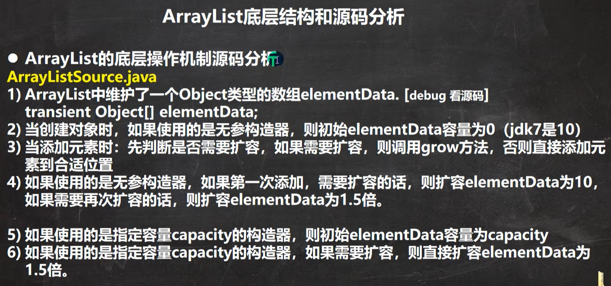
    扩容源码(grow)：
