String类的基本常识：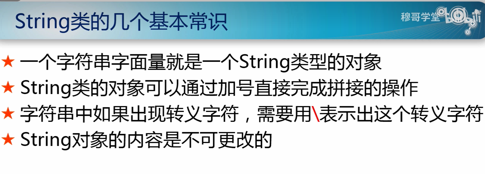
测试题：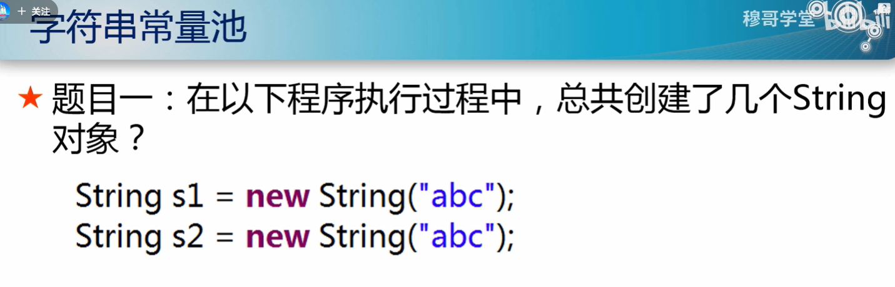
       String特性：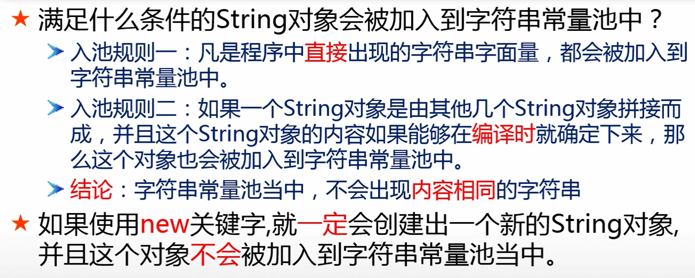 
       字符串的比较：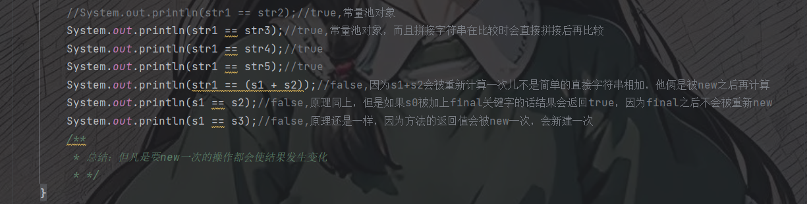；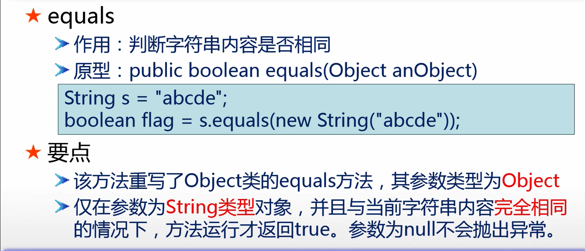
       字符串的拼接：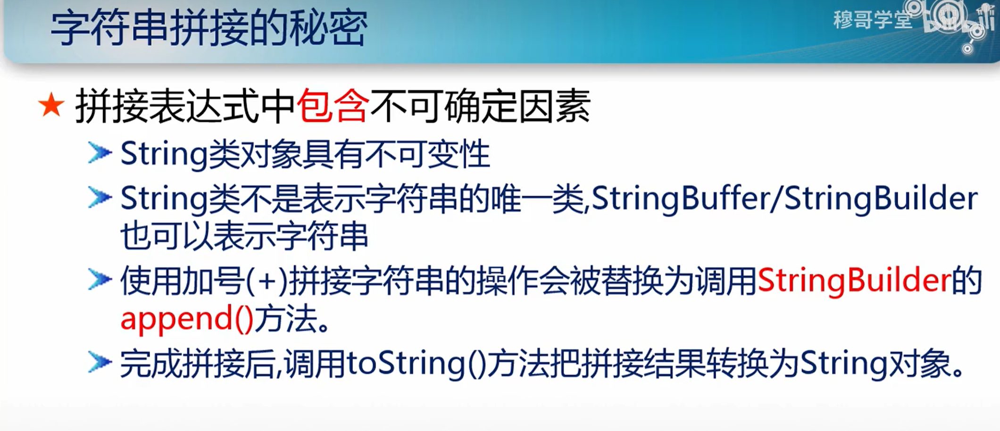
              拼接的写法：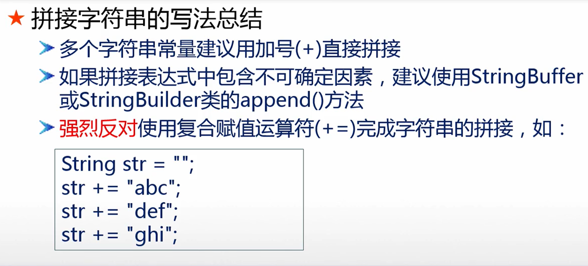
       字符串的intern方法：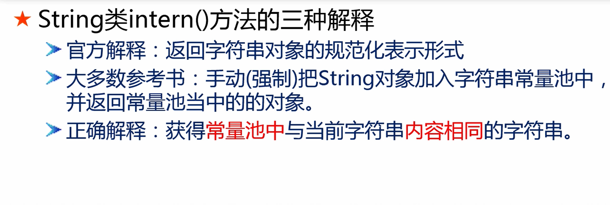
       获取字符串长度：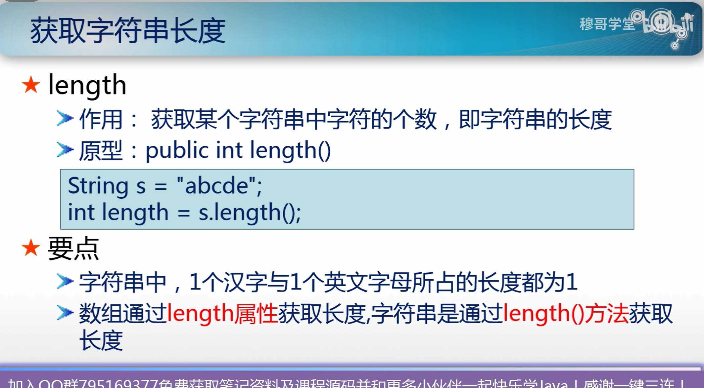
       搜索字符串：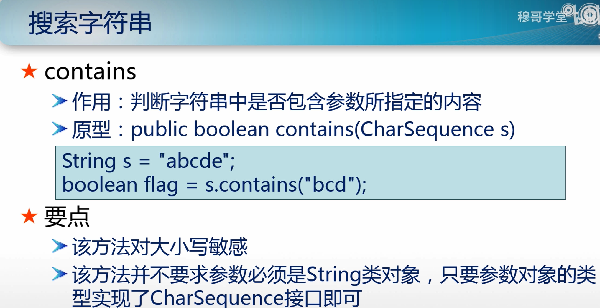
       替换子字符串：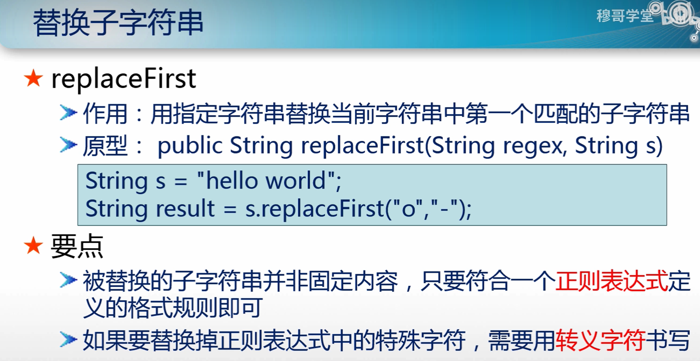
       截取字符串：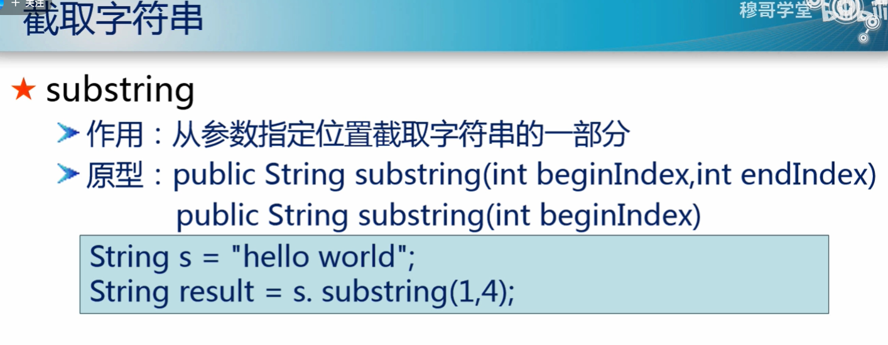
              substring和subSequence的区别：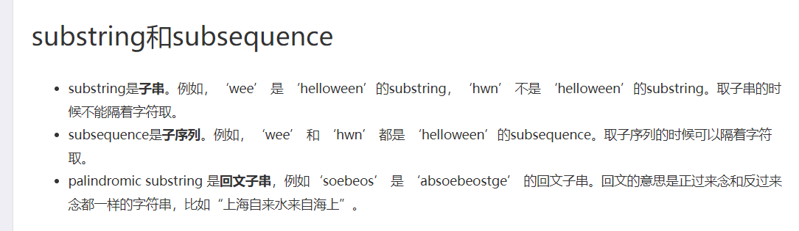
       拆分字符串：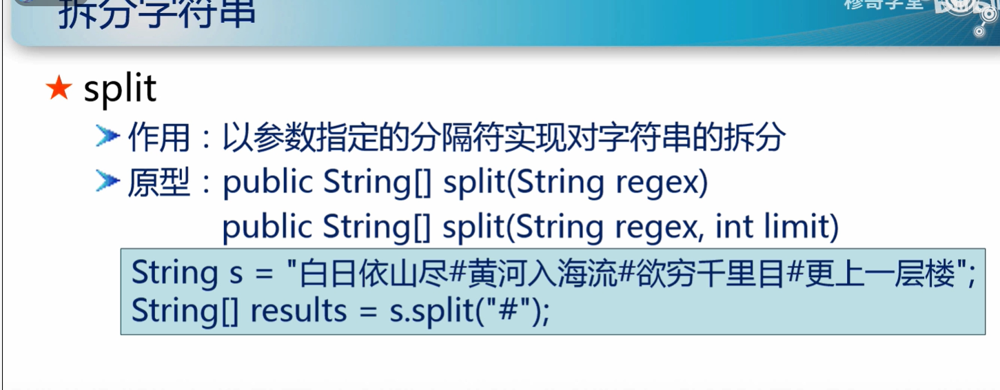
       拼接字符串：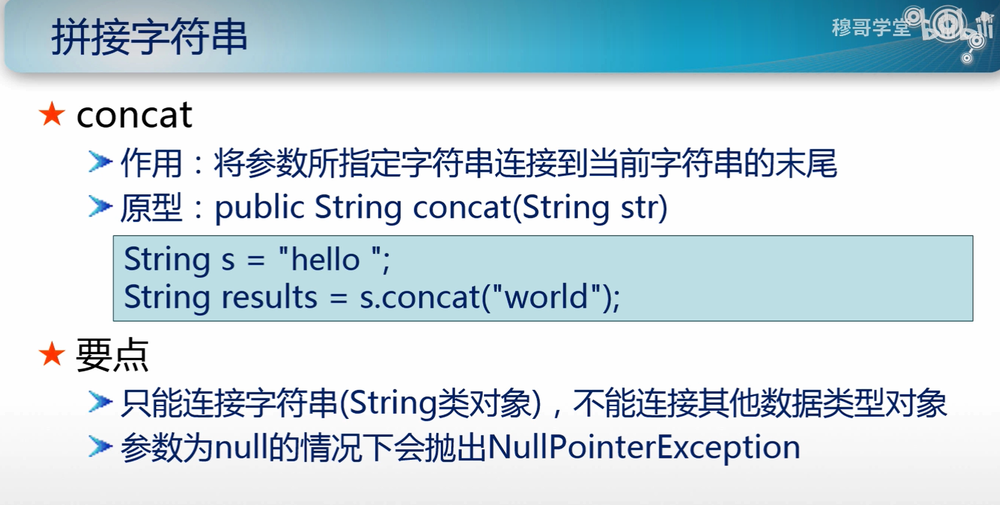
                 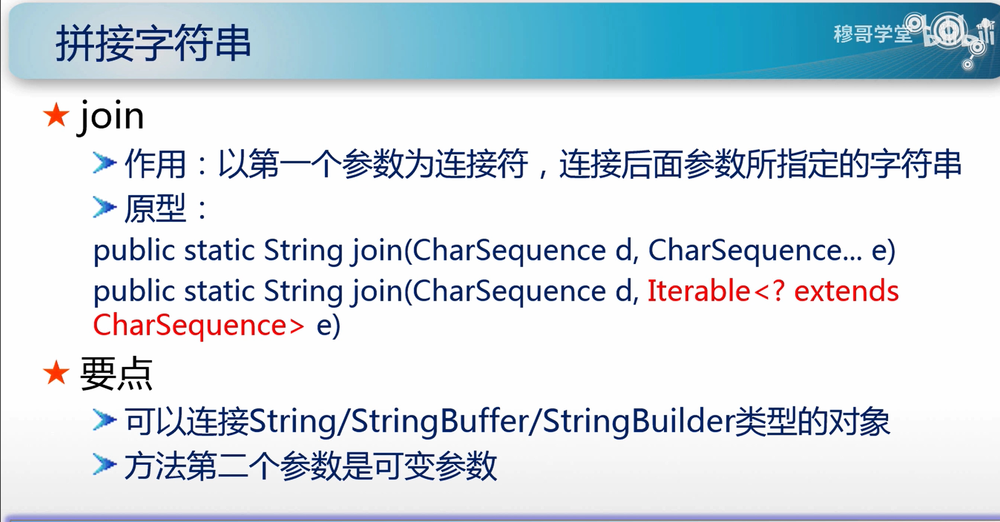
       转换字符串：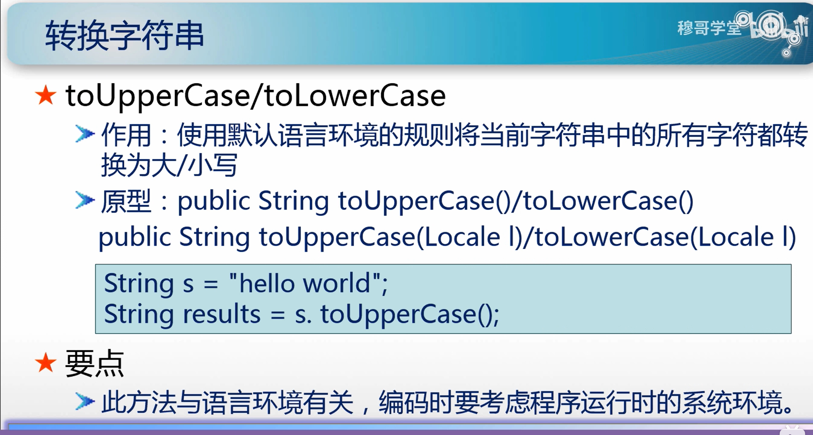
   其他所有的字符串家族成员：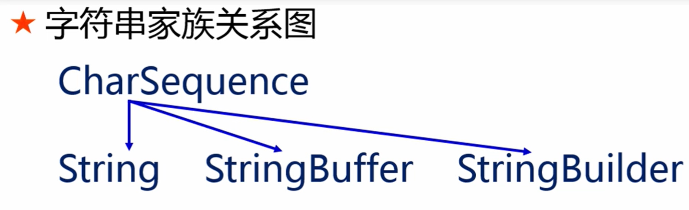
                        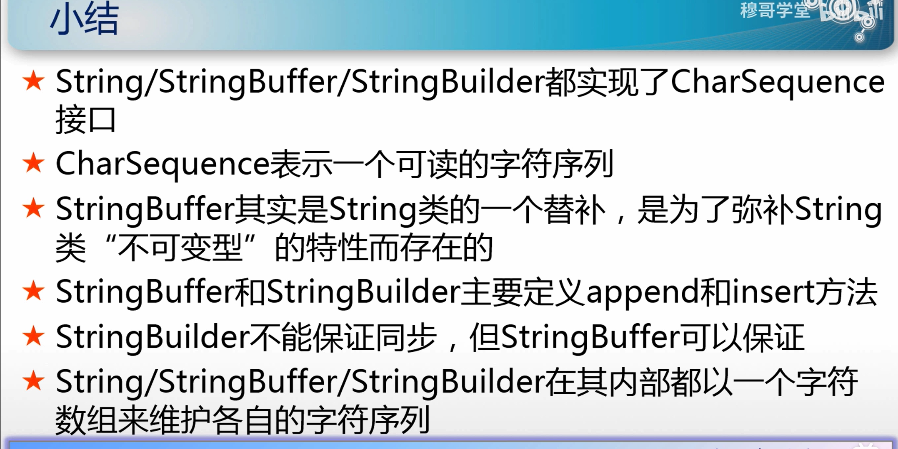
       MD5加密：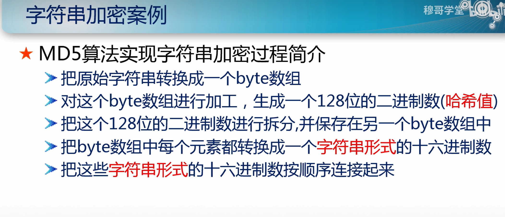