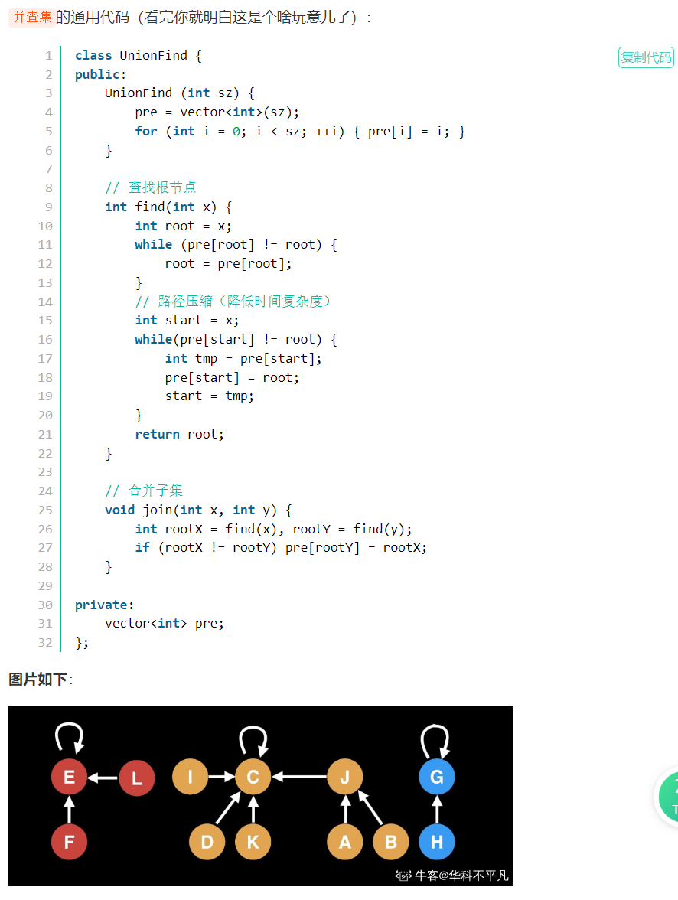

并查集通用代码：

```
java核心代码：

	//查询父节点方法
	public static int find(int i) {
		// 沿途收集了几个点
		int size = 0;
		while (i != father[i]) {
			stack[size++] = i;
			i = father[i];
		}
		// 沿途节点收集好了，i已经跳到代表节点了
		while (size > 0) {
			father[stack[--size]] = i;
		}
		return i;
	}
	//查询方法
	public static boolean isSameSet(int x, int y) {
		return find(x) == find(y);
	}
	//合并方法
	public static void union(int x, int y) {
		int fx = find(x);
		int fy = find(y);
		if (fx != fy) {
			// fx是集合的代表：拿大小
			// fy是集合的代表：拿大小
			if (size[fx] >= size[fy]) {
				size[fx] += size[fy];
				father[fy] = fx;
			} else {
				size[fy] += size[fx];
				father[fx] = fy;
			}
		}
	}
	//主方法
    public static void main(String[] args) throws IOException {
		BufferedReader br = new BufferedReader(new InputStreamReader(System.in));
		StreamTokenizer in = new StreamTokenizer(br);
		//打印流
		PrintWriter out = new PrintWriter(new OutputStreamWriter(System.out));
		while (in.nextToken() != StreamTokenizer.TT_EOF) {
			n = (int) in.nval;
			build();
			in.nextToken();
			int m = (int) in.nval;
			for (int i = 0; i < m; i++) {
				in.nextToken();
				int op = (int) in.nval;
				in.nextToken();
				int x = (int) in.nval;
				in.nextToken();
				int y = (int) in.nval;
				if (op == 1) {
					//查询两个数所在集合是不是同一个
					out.println(isSameSet(x, y) ? "Yes" : "No");
				} else {
					//合并
					union(x, y);
				}
			}
		}
		out.flush();
		out.close();
		br.close();
	}
	//优化时创建一个用来定义父节点的build，直接摈弃了使用栈去挨个添加节点再查找的方式
	public static void build(int m) {
		for (int i = 0; i < m; i++) {
			father[i] = i;
		}
		sets = m;
	}
```

