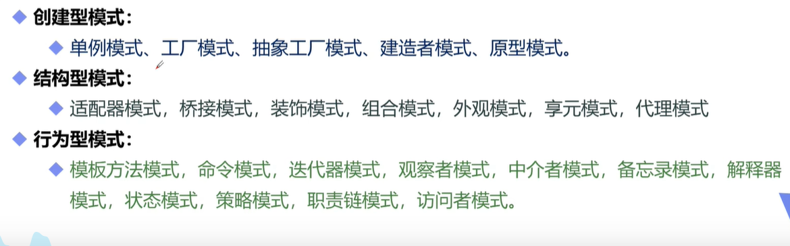
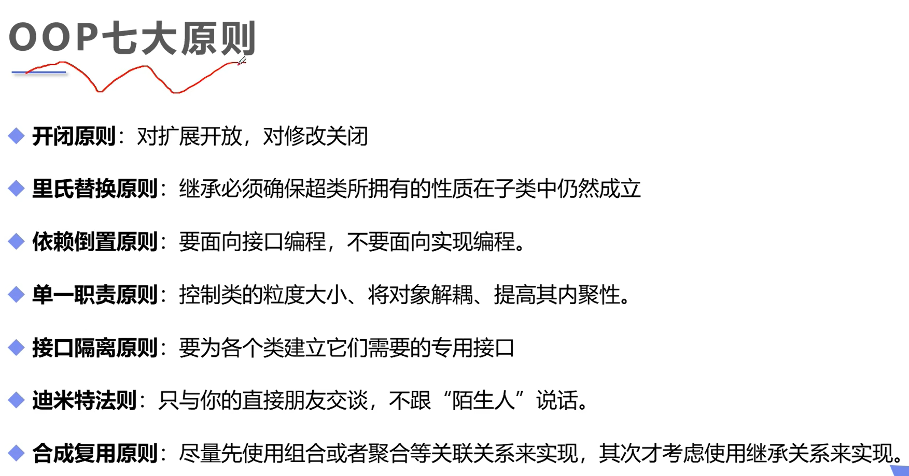
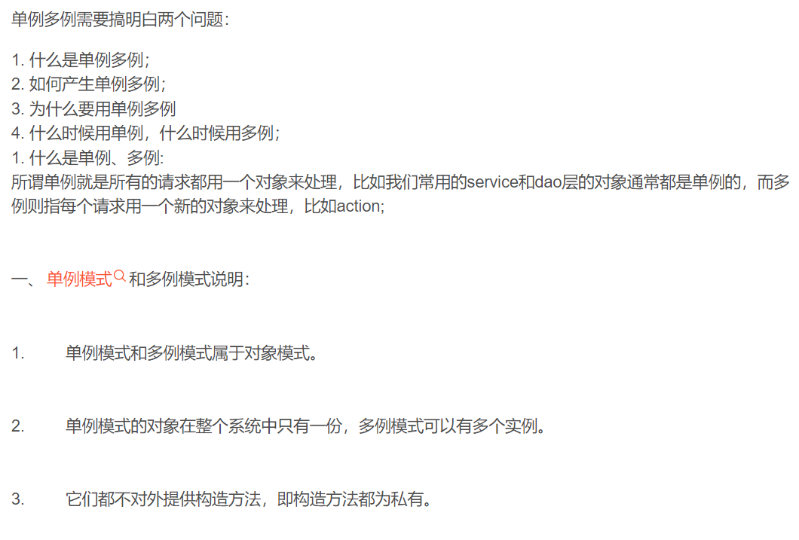
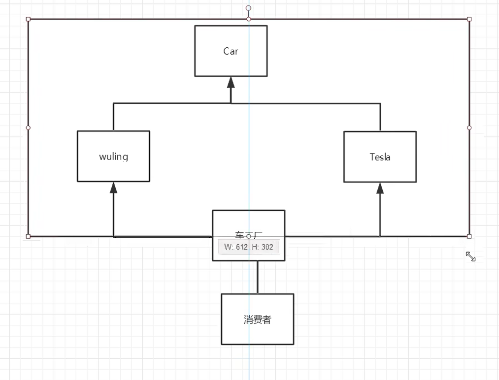
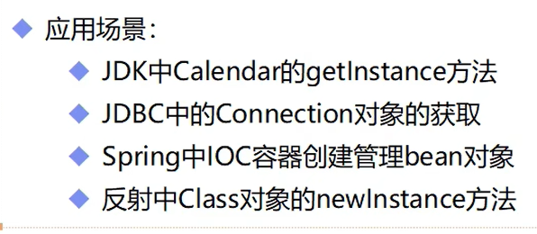
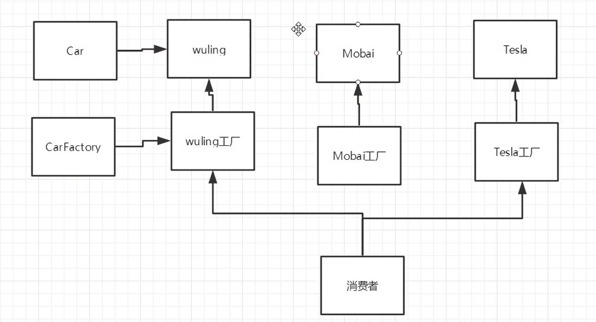
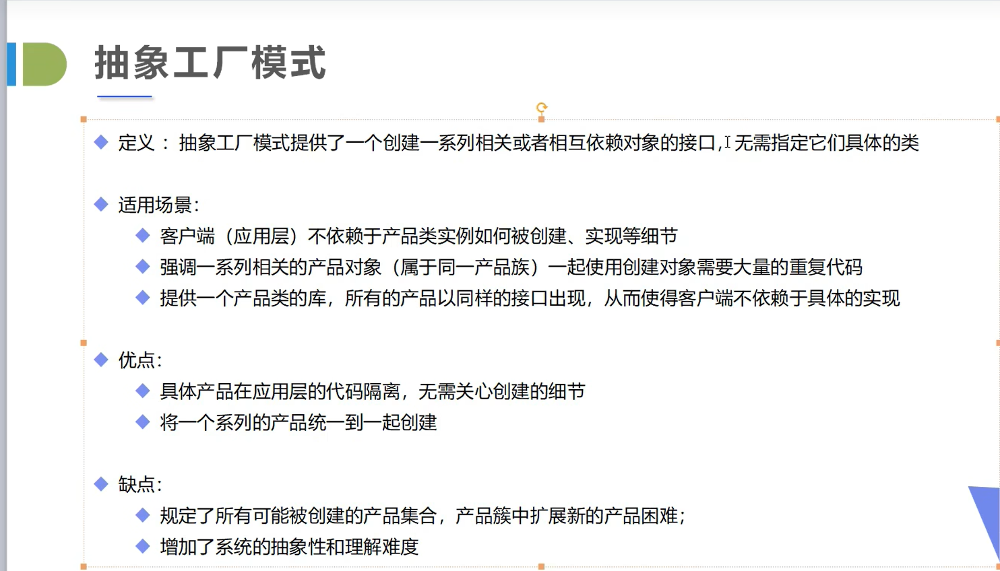
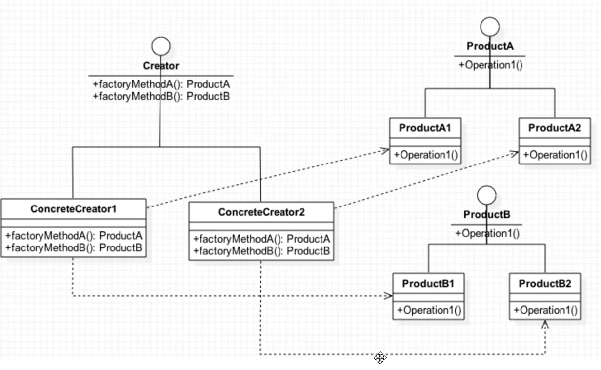
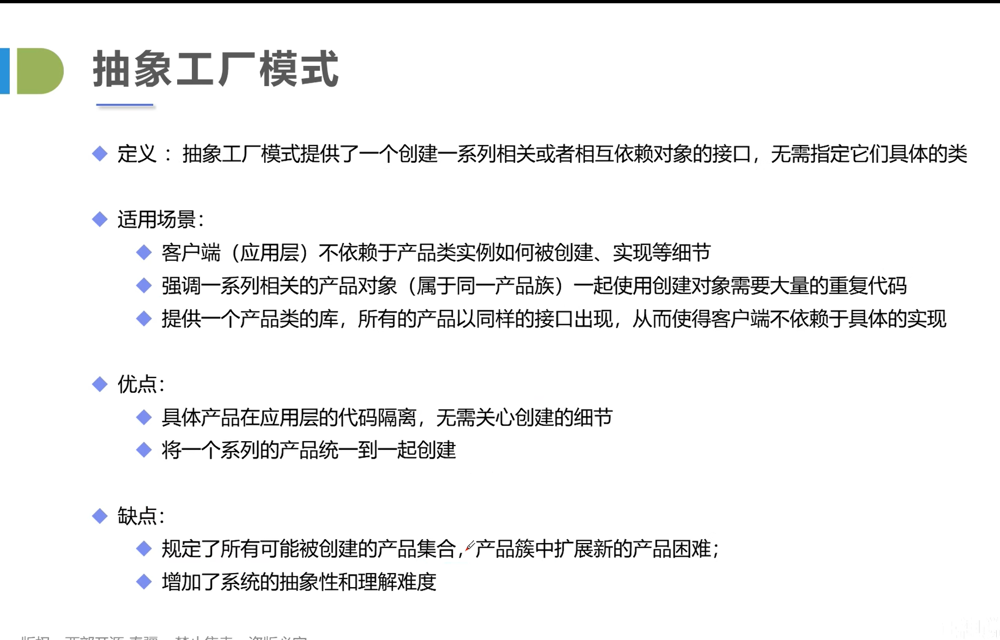

1.二十三种设计模式
2.面向对象OOP七大设计原则

一、单例模式!singlePayyern
    如源码所讲，不能用反射破坏枚举[img_2.png](img_2.png)
    单例模式和多例模式有什么区别：
二、工厂模式：实现创建者和调用者的分离
        核心本质：实例化对象不使用new，使用工厂方法代替
                将选择实现类，创建对象统一管理和控制，从而将调用者和实现类解耦
           抽象工厂模式
                优缺点：
                围绕一个超级工厂创建其他工厂，该超级工厂成为其他工厂的工厂
           简单工厂模式（静态工厂模式）
                用来生产统一结构等级中的任意产品
           工厂方法模式
                用来生产同一结构等级中的固定产品
        工厂模式满足：
                   开闭原则：一个软件的实体应当对扩展开放，对修改关闭
                   依赖倒转原则：针对接口编程，不要针对实现编程
                   迪米特法则：直接和朋友通信，避免和陌生人通信
        结构复杂度：simple
        代码复杂度：simple
        编程复杂度：simple
        管理复杂度：simple
        根据设计原则：优先使用工厂方法模式
        根据实际业务：简单工厂模式