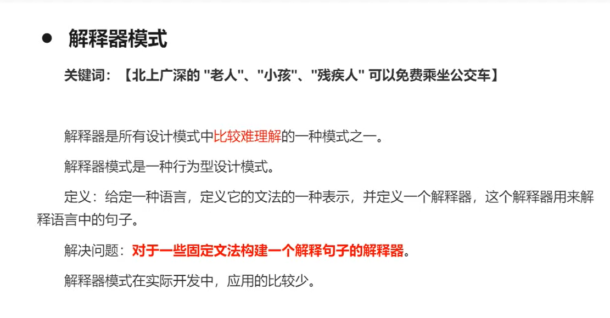
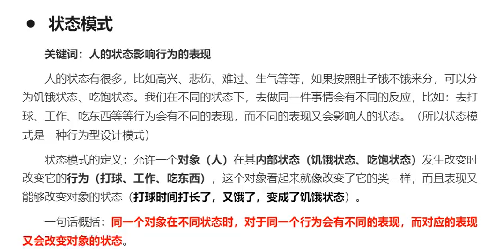

1.二十三种设计模式
笔记参考链接：https://www.runoob.com/design-pattern/factory-pattern.html
2.面向对象OOP七大设计原则
一、创建型模式
1、单例模式!singlePayyern
    如源码所讲，不能用反射破坏枚举[img_2.png](image/img_2.png)
    单例模式和多例模式有什么区别：
2、工厂模式：实现创建者和调用者的分离
        核心本质：实例化对象不使用new，使用工厂方法代替
                将选择实现类，创建对象统一管理和控制，从而将调用者和实现类解耦
           3、抽象工厂模式
                优缺点：
                围绕一个超级工厂创建其他工厂，该超级工厂成为其他工厂的工厂
              简单工厂模式（静态工厂模式）
                用来生产统一结构等级中的任意产品
              工厂方法模式
                用来生产同一结构等级中的固定产品
        工厂模式满足：
                   开闭原则：一个软件的实体应当对扩展开放，对修改关闭
                   依赖倒转原则：针对接口编程，不要针对实现编程
                   迪米特法则：直接和朋友通信，避免和陌生人通信
        结构复杂度：simple
        代码复杂度：simple
        编程复杂度：simple
        管理复杂度：simple
        根据设计原则：优先使用工厂方法模式
        根据实际业务：简单工厂模式
4、建造者模式
        
        
        
    建造者模式的优缺点：
    建造者模式应用场景和其他模式比较

5、原型模式
    深克隆和浅克隆

二、结构性模式
        
        1、适配器模式adapter
            优缺点和适用场景：
        2、代理模式优缺点：agent
        3、桥接模式
            优缺点和适用场景：
        4、装饰器模式
            装饰器模式主要解决继承关系过于复杂的问题，通过组合代替继承，主要用来给原始类增强功能
            优缺点：
        5、组合模式（分为透明组合模式和安全组合模式）
            特点：
        6、外观模式
                解释：
        7、享元模式
                解释：
三、行为型模式：
        1、模板方法模式
            定义：
            主要角色：
        2、命令模式
            定义：
            主要角色和结构：
        3、迭代器模式
            定义：
            主要角色和结构：
        4、观察者模式
            定义和角色：
            结构和场景：
        5、中介者模式
            定义和角色：
            结构和场景：
        6、备忘录模式
            定义和角色：
            结构和场景：
        7、解释器模式
            定义和角色：
            结构和场景：
        8、状态模式
            定义和角色：
            结构和场景：
            策略模式和状态模式比较：后者更倾向于算法上的修改，并且可以在运动时进行任意的动态替换。后者主要是改变状态来影响其他行为
        9、策略模式
            定义和角色：
            结构和场景：
        10、职责链模式
            定义和角色：
            结构和场景：
        11、访问者模式
            定义和角色：
            结构和场景：缺点：