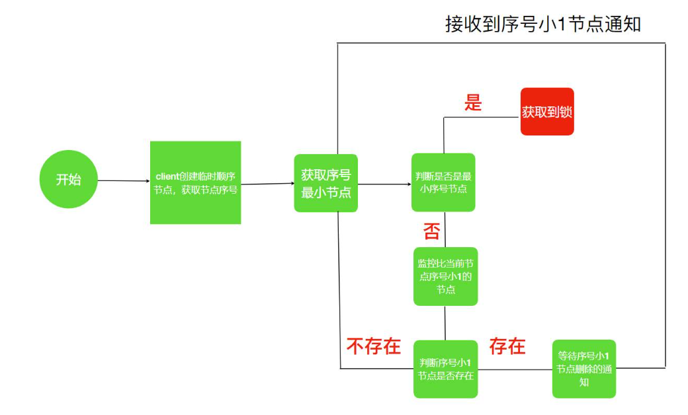
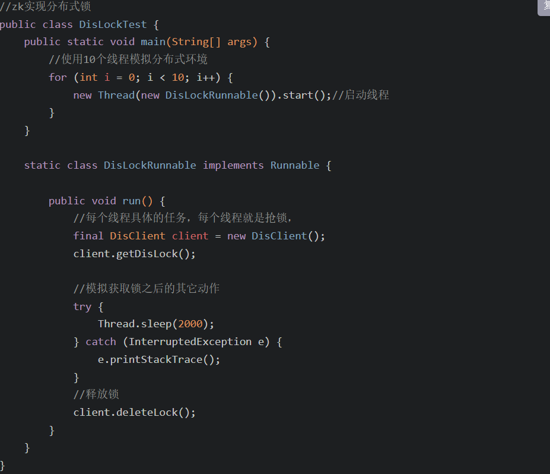

CAP原则（在满足分区容错性的前提下一致性和可用性一般只能保证一个）：
    Consistency (一致性)：即更新操作成功并返回客户端后，所有节点在同一时间的数据完全一致，这就是分布式的一致性。一致性的问题在并发系统中不可避免，对于客户端来说，
        一致性指的是并发访问时更新过的数据如何获取的问题。从服务端来看，则是更新如何复制分布到整个系统，以保证数据最终一致。
    Availability (可用性)：可用性指“Reads and writes always succeed”，即服务一直可用，而且是正常响应时间。好的可用性主要是指系统能够很好的为用户服务，不
        出现用户操作失败或者访问超时等用户体验不好的情况。
    Partition Tolerance (分区容错性)：
        即分布式系统在遇到某节点或网络分区故障的时候，仍然能够对外提供满足一致性和可用性的服务。分区容错性要求能够使应用虽然是一个分布式系统，而看上去却好像是在一个
        可以运转正常的整体。比如现在的分布式系统中有某一个或者几个机器宕掉了，其他剩下的机器还能够正常运转满足系统需求，对于用户而言并没有什么体验上的影响。

分布式锁：
        当在分布式模型下，数据只有一份（或有限制），此时需要利用锁的技术控制某一时刻修改数据的进程数；
        与单机模式下的锁不仅需要保证进程可见，还需要考虑进程与锁之间的网络问题。（我觉得分布式情况下之
    所以问题变得复杂，主要就是需要考虑到网络的延时和不可靠。。。一个大坑）；
        分布式锁还是可以将标记存在内存，只是该内存不是某个进程分配的内存而是公共内存如 Redis、Memcache。
    至于利用数据库、文件等做锁与单机的实现是一样的，只要保证标记能互斥就行。
    方式一：集成redis
        代码实现案例：
        缺陷：Redis 分布式锁不能解决超时的问题，分布式锁有一个超时时间，程序的执行如果超出了锁的超时时间就会出现问题。
        redis的内存优化:
        redis实现方式：哨兵模式、集群模式，都是三个节点，一主二从；主节点挂了从从节点上选。

redis的一致性原理：
Redis持久化的两种方式：RDB和AOF
            RDB:在不同的时间点，将redis存储的数据生成快照并存储到磁盘等介质上;
            AOF:将redis执行过的所有写指令记录下来，在下次redis重新启动时，只要把这些写指令从前到后再重复执行一遍，就可以实现数据恢复了
    RDB和AOF两种方式也可以同时使用，在这种情况下，如果redis重启的话，则会优先采用AOF方式来进行数据恢复，这是因为AOF方式的数据恢复完整度更高。
    如果没有数据持久化的需求，也完全可以关闭RDB和AOF方式，这样的话，redis将变成一个纯内存数据库，就像memcache一样。
    redis命令：
        MULTI :开启事务，redis会将后续的命令逐个放入队列中，然后使用EXEC命令来原子化执行这个命令系列。
        EXEC：执行事务中的所有操作命令。
        DISCARD：取消事务，放弃执行事务块中的所有命令。
        WATCH：监视一个或多个key,如果事务在执行前，这个key(或多个key)被其他命令修改，则事务被中断，不会执行事务中的任何命令。
        UNWATCH：取消WATCH对所有key的监视。
    redis   缓存穿透：大量请求根本不存在的key；因为服务出于容错考虑，当请求从持久层查不到数据则不写入缓存，这将导致请求
这个不存在的数据每次都要到持久层去查询，失去了缓存的意义。 此时，缓存起不到保护后端持久层的意义，就像被穿透了一样。导致数据库存在被打挂的风险
            解决方案：
            缓存雪崩：redis中大量key集体过期；
            解决方案：
            缓存击穿：redis中一个热点key过期。
            解决方案:
    Redis key 设置过期时间和永久有效:EXPIRE 和 PERSIST;
    方式二：
        zookeeper实现分布式锁：利用Zookeeper可以创建临时带序号节点的特性来实现一个分布式锁
        思路：1、锁就是zk指定目录下序号最小的临时序列节点，多个系统的多个线程都要在此目录下创建临时的顺序节点，因为Zk会为我们保证节点的顺序性，所以可以利
        用节点的顺序进行锁的判断。
             2、每个线程都是先创建临时顺序节点，然后获取当前目录下最小的节点(序号)，判断最小节点是不是当前节点，如果是那么获取锁成功，如果不是那么获取锁
        失败。
             3、获取锁失败的线程获取当前节点上一个临时顺序节点，并对对此节点进行监听，当该节点删除的时候(上一个线程执行结束删除或者是掉线zk删除临时节点)
        这个线程会获取到通知，代表获取到了锁。
        流程：
        代码：,核心方法
学习链接：https://blog.csdn.net/qq837993702/article/details/128069225

        
    
