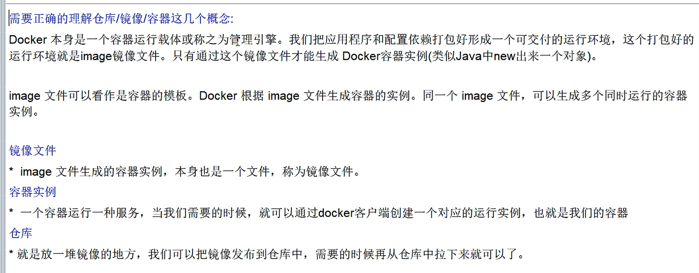
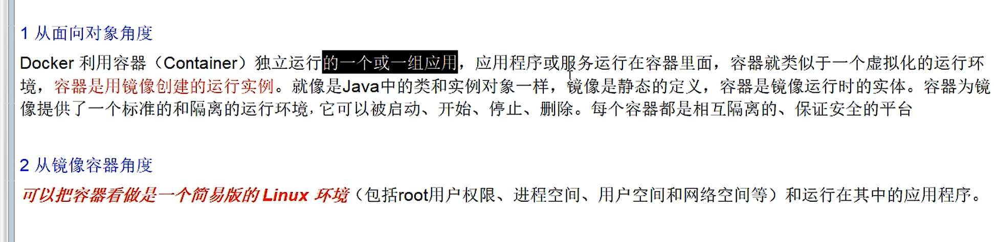
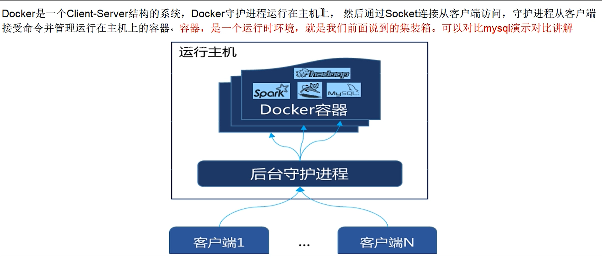
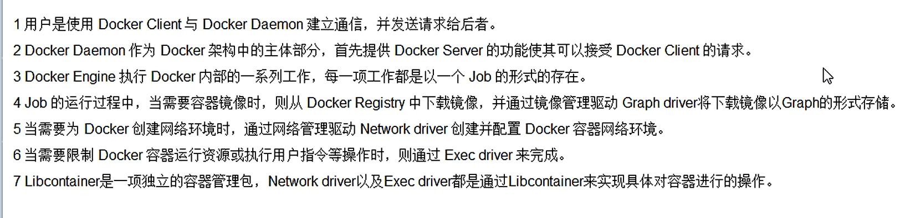
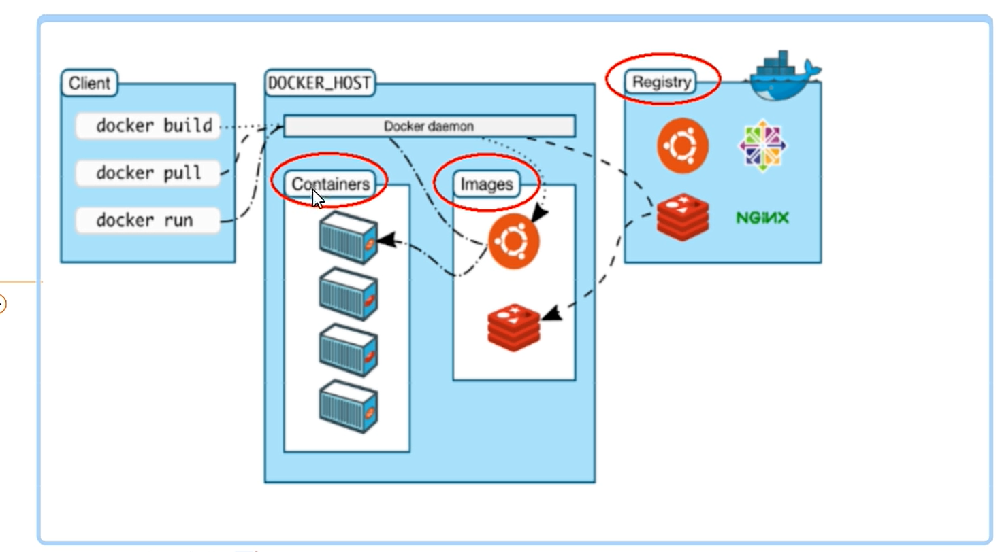

docker实际上是最小最内核赖以生存的Linux内核文件不需要的不加载，本质上是一个简易版的Linux环境
基本组成包括：镜像、容器、仓库三个部分；
镜像相当于是一个可以复制的根目录文件；
容器相当于是一个可以运行程序的系统或是环境；
仓库是集中存放镜像文件的场所

docker架构图

--安装docker
进入root目录下：
1、安装gcc:yum -y install gcc
2、安装gcc-c++:yum -y install gcc-c++
3、安装repository: yum install -y yum-utils
4、设置镜像仓库：yum-config-manager --add-repo http://mirrors.aliyun.com/docker-ce/linux/centos/docker-ce.repo
5、更新yum:yum makecache fast
6、安装docker：yum install docker-ce docker-ce-cli containerd.io