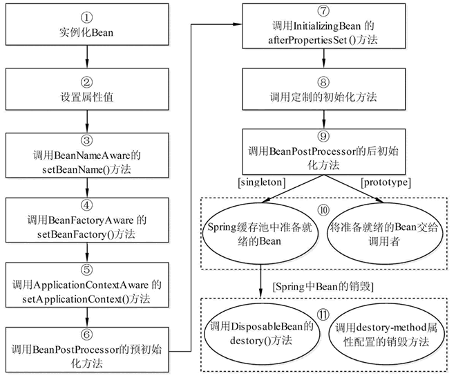
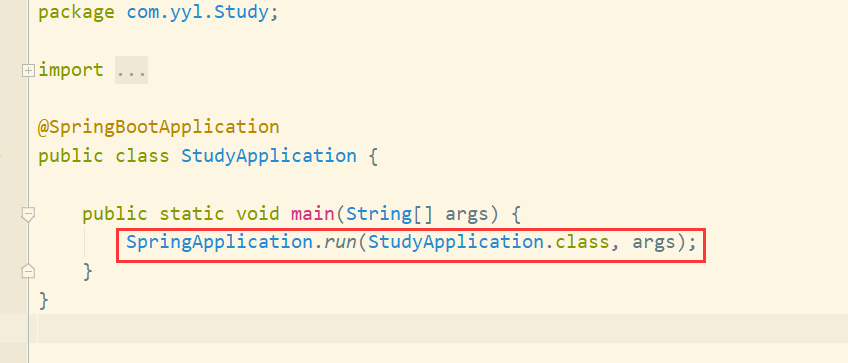

bean的生命周期：
        1.创建前准备；
        2、实例化 Instantiation：当客户向容器请求一个尚未初始化的bean时，或初始化bean的时候需要注入另一尚未初始化的依赖时，
    容器会调用createBean进行实例化；
        3、设置对象属性（依赖注入）：实例化后的对象被封装在BeanWrapper对象中，Spring根据BeanDefinition中的信息以及通过
    BeanWrapper提供的设置属性的接口完成属性设置与依赖注入；
        4、处理Aware接口：拿到被封装对象之后就可以通过aware接口调用然后被使用；
        5、使用完之后就会被销毁。
    
Spring AOP:
    springAOP是spring的一个核心设计理念，及面向切面编程；由于有了bean的理念，就有了中间层代理实现对象托管的模式，而需要额外处理的
部分就变成了由中间层代理的模式，即切面编程模式。
Spring IOC和DI:
    IOC:这部分功能相当于所有 Spring 框架运行的基础，以前我们操作对象都需要手动的 new 对象，由对象的作用域决定对象的生命周期。
使用 Spring 后，由框架提供了统一的容器来实例化、管理这些对象，并自动组织对象与对象间的关系。这种容器称为 IoC 容器，
有些地方也叫 Spring Bean 容器、Spring 容器。对象之间的复杂关系（体现在代码中就是对象中成员变量，引用了另一个对象），
也交给了容器来进行设置。它把传统上由程序代码直接操控的对象的调用权交给容器，通过容器来实现对象组件的装配和管理。所谓的
“控制反转” 概念就是对组件对象控制权的转移，从程序代码本身转移到了外部容器。
    DI:相对于IoC而言，依赖注入更加准确地描述了IoC的设计理念。所谓依赖注入（Dependency Injection）就是由IOC容器
在运行期间，动态地将某种依赖关系注入到对象之中，即组件之间的依赖关系由容器在应用系统运行期来决定，也就是由容器动态地将某
种依赖关系的目标对象实例注入到应用系统中的各个关联的组件之中。组件不做定位查询，只提供普通的Java方法让容器去决定依赖关系。
    DI的基本原则：应用组件不应该负责查找资源或者其他依赖的协作对象。配置对象的工作应该由IoC容器负责，“查找资源”的逻辑应
该从应用组件的代码中 抽取出来，交给IoC容器负责。容器全权负责组件的装配，它会把符合依赖关系的对象通过属性（JavaBean中的
setter）或者是构造器传递给需要的对象。
@Autowaire和@Resource的区别：
    @Autowired 是 Spring 定义的注解，@Resource 是 Java 定义的注解；
    查找顺序刚好相反：前者先根据类型，后者先根据名称。
依赖注入的方式：
    1.属性注入（Field Injection）
    2.构造器注入（Constructor Injection） 
    3.setter 方法注入;
springMVC的流程：
    
    1.用户向服务器发送请求，请求被Spring 前端控制Servelt DispatcherServlet(中央处理器)捕获；
    2.DispatcherServlet对请求URL进行解析，得到请求资源标识符（URI）。然后根据该URI，调用HandlerMapping获得该Handler配置
的所有相关的对象（包括Handler对象以及Handler对象对应的拦截器），最后以HandlerExecutionChain对象的形式返回给
DispatcherServlet(中央处理器)；
    3.DispatcherServlet 根据获得的Handler，选择一个合适的HandlerAdapter。（附注：如果成功获得HandlerAdapter后，
此时将开始执行拦截器的preHandler(…)方法）
    4.提取Request中的模型数据，填充Handler入参，开始执行Handler（Controller)。 在填充Handler的入参过程中，根据你的配置，
Spring将帮你做一些额外的工作：
HttpMessageConveter： 将请求消息（如Json、xml等数据）转换成一个对象，将对象转换为指定的响应信息数据转换：
对请求消息进行数据转换。如String转换成Integer、Double等数据根式化：对请求消息进行数据格式化。 如将字符串转换成格式化数字
或格式化日期等数据验证： 验证数据的有效性（长度、格式等），验证结果存储到BindingResult或Error中.
    5.Handler执行完成后，向DispatcherServlet 返回一个ModelAndView对象；
    6.根据返回的ModelAndView，选择一个适合的ViewResolver（必须是已经注册到Spring容器中的ViewResolver)返回给
DispatcherServlet ；
    7.ViewResolver 结合Model和View，来渲染视图
    8.将渲染结果返回给客户端。
SpringMVC常用注解：
    @Controller ：用于配合组件扫描创建控制器对象，常与@RequestMapping配合使用，包括元注解@Component;
    @RequestController:它元注解有@Controller 和 @ResponseBody 注解;
    @ResponseBody: 表明控制器方法的返回值绑定到 HTTP 响应体;
    @RequstMapping：使用@RequestMapping 注解来映射请求到控制器方法;
    @PostMapping：用于将 HTTP POST 请求映射到特定的处理方法的注解;
    @GetMapping ：用于将 HTTP GET 请求映射到特定的处理方法的注解;
    @RequestBody ：标注在方法参数上，表示网络请求正文映射到方法参数;
    @RequestParam：将请求参数映射到控制器的方法参数上;
    @PathVariable：将请求路径上“URI 模版”映射到控制器的方法参数上;
    @ResponseStatus: 设定 HTTP 响应状态码;
    @RequestHeader：映射请求头到控制器方法参数.
@RequestMapping 和 GetMapping 和@PostMapping 三者的区别：http映射方式不同。
MyBatis相关
    优点：基于SQL语句编程，相当灵活，不会对应用程序或者数据库的现有设计造成任何影响，SQL写在XML里，解除sql与程序代码的耦合，
便于统一管理；提供XML标签，支持编写动态 SQL语句，并可重用。与JDBC相比，减少了50%以上的代码量，消除了JDBC大量冗余的代码，不
需要手动开关 连接；很好的与各种数据库兼容（因为MyBatis使用JDBC来连接数据库，所以只要JDBC支持 的数据库MyBatis都支持）。能
够与Spring很好的集成；提供映射标签，支持对象与数据库的ORM字段关系映射；提供对象关系映射 标签，支持对象关系组件维护。
    缺点：SQL 语句的编写工作量较大；SQL 语句依赖于数据库，导致数据库移植性差，不能随意更换数据库
执行过程：： 
    1.读取 MyBatis 的配置文件。mybatis-config.xml 为 MyBatis 的全局配置文件，用于配置数据库连接信息。
    2.加载映射文件。映射文件即 SQL 映射文件，该文件中配置了操作数据库的 SQL 语句，需要在 MyBatis 配置文件 
mybatis-config.xml 中加载。mybatis-config.xml 文件可以加载多个映射文件，每个文件对应数据库中的一张表。
    3.构造会话工厂。通过 MyBatis 的环境配置信息构建会话工厂 SqlSessionFactory。
    4.创建会话对象。由会话工厂创建 SqlSession 对象，该对象中包含了执行 SQL 语句的所有方法。
    5.Executor 执行器。MyBatis 底层定义了一个 Executor 接口来操作数据库，它将根据SqlSession 传递的参数动态地生成需要
执行的 SQL 语句，同时负责查询缓存的维护。
    6.MappedStatement 对象。在 Executor 接口的执行方法中有一个 MappedStatement 类型 的参数，该参数是对映射信息的封装，
用于存储要映射的 SQL 语句的 id、参数等信息。
    7.输入参数映射。输入参数类型可以是 Map、List 等集合类型，也可以是基本数据类型和 POJO 类型。输入参数映射过程类似于JDBC
对preparedStatement 对象设置参数的过程。
    8.输出结果映射。输出结果类型可以是 Map、List 等集合类型，也可以是基本数据类型和 POJO类型。输出结果映射过程类似于JDBC
对结果集的解析过程。
SpringBoot的核心配置文件有哪几个?他们的区别是什么:
    application:用于 Spring Boot 项目的自动化配置;
    bootstrap:添加连接到配置中心的配置属性来加载外部配置中心的配置信息
SpringBoot的核心注解:
    @SpringBootApplication:它主要封装了以下几个注解用来启动整个项目，也可以说是spring boot的自动装配规则
        1、@EnableAutoConfiguration：开启自动配置功能；
        2、@ComponetScan：扫描组件；扫描当前包及其子包下被@Component，@Controller，@Service，@Repository注解标记
        的类并纳入到spring容器中进行管理；
        3、@Target：说明注解的作用目标，默认值为任何元素；
        4、@Retention：元注解，用来表示注解的[生命周期]；
        5、@Documented：元注解，可以修饰其他注解；
        6、@Inherited：元注解，表示子类可继承
.properties 和 .yml：
    它们的区别主要是书写格式不同。
springboot启动流程：
        Spring Boot项目创建完成会默认生成一个名为 *Application 的入口类，我们是通过该类的main方法启动Spring Boot项目的。
    在main方法中，通过SpringApplication的静态方法，即run方法进行SpringApplication类的实例化操作，然后再针对实例化对象调用
    另外一个run方法来完成整个项目的初始化和启动。
        再调用另外一个run方法：，这俩方法主要构造SpringApplection的
    实例以及调用实例的run方法
微服务组件：
    注册中心：Eureka；（Nacos）
    网关：Gateway;(Zuul)
    负载均衡器：Ribbon;
    服务调用：Feign;
    熔断限流：Hystix;
    分布式配置中心：config。
分布式和springcloud:
    
        

    

    
    