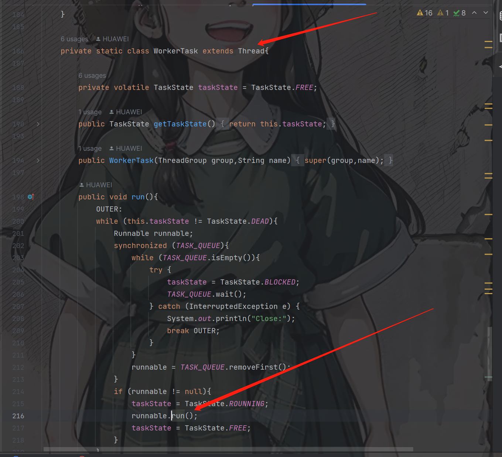
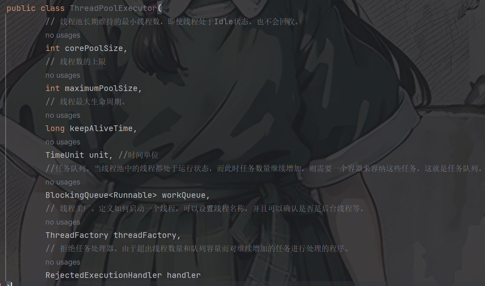
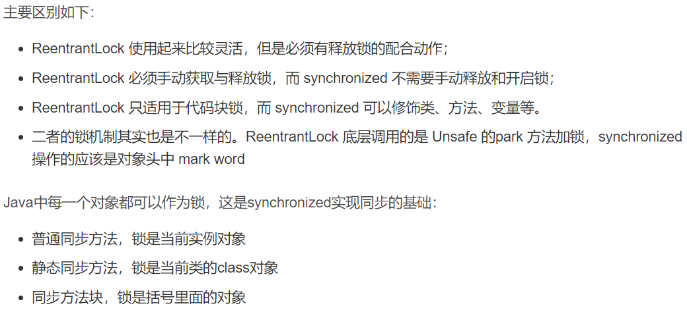
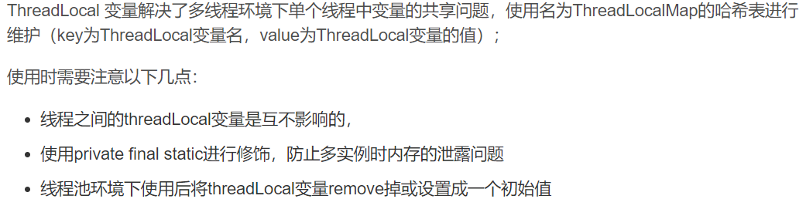

异或运算------------    ^

代码示例

转二进制方法：Integer.toBinaryString

== 和 equals 的区别是什么：
    对于基本类型，==是比较的值，对于引用类型，==比较的是地址；
    如果没有重写equals，则此时equals相当于==；如果重写了equals,则其比较的是内容。
final的作用：
    修饰成员变量，表示不可再做更改，其修饰的子类不可以被继承；
    final类中的方法默认是final的；private类型的方法默认是final的；
线程的创建方式：
    1.继承Thread类重写run方法；
    2、实现Runable接口；（原则上这个方式是第一个方法的变种）；!
    3、实现Callable接口；
    4、可以通过创建线程池创建
线程间通信方式：
    1、使用 volatile 关键字（共享内存思想）：大致意思就是多个线程同时监听一个变量，当这个变量发生变化的时候 ，线程能够感
知并执行相应的业务。这也是最简单的一种实现方式
    2、方式二：使用Object类的wait()、notify()、notifyaAl() 方法：它们是多线程通信的基础，而这种实现方式的思想自然是
线程间通信，三则必须配合synchronized使用，wait是释放锁，其他二者是不释放锁；
    wait(long) 方法的功能是等待某一时间内是否有线程对锁进行唤醒，如果超过这个时间则自动唤醒，
    notify() 方法作用是随机通知一个当前对象锁的阻塞队列中的线程（即调用过wait方法的线程），
    notifyAll() 方法作用是唤醒当前对象锁阻塞队列中的所有线程(即调用过wait方法的线程）；
    3、join()
run()和start()有什么区别:
    start() 方法用于启动线程，run() 方法用于执行线程的运行时代码。run() 可以重复调用，而 start() 只能调用一次。
线程的生命周期：
    1、新建，是刚使用new方法，new出来的线程；
    2、就绪，是调用的线程的start()方法后，这时候线程处于等待CPU分配资源阶段；
    3、运行，当就绪的线程被调度并获得CPU资源时，便进入运行状态；
    4、阻塞，在运行状态的时候，可能因为某些原因导致运行状态的线程变成了阻塞状态；
    5、销毁，线程正常执行完毕后或线程被提前强制性的终止或出现异常导致结束，那么线程就要被销毁。
悲观锁和乐观锁：
    1、悲观锁（synchronized、ReentrantLock）：悲观锁总是假设最坏的情况，认为共享资源每次被访问的时候就会出现问题(比如共享
数据被修改)， 所以 每次在获取资源操作的时候都会上锁，这样其他线程想拿到这个资源就会阻塞直到锁被上一个持有者释放。也就是说，共享资
源每次只给一个线程 使用，其它线程阻塞，用完后再把资源转让给其它线程。高并发的场景下，激烈的锁竞争会造成线程阻塞，大量阻塞线程会导
致系统的上下文切换，增加系统的性能开销。 并且，悲观锁还可能会存在死锁问题，影响代码的正常运行
    2、乐观锁（AtomicInteger、LongAdder、CAS算法）：乐观锁总是假设最好的情况，认为共享资源每次被访问的时候不会出现问题，线
程可以不停地执行，无需加锁也无需等待，只是在提交修改的时候去验证对应的资源（也就是数据）是否被其它线程修改了，高并发的场景下，乐观
锁相比悲观锁来说，不存在锁竞争造成线程阻塞，也不会有死锁的问题，在性能上往往会更胜一筹。但是，如果冲突频繁发生（写占比非常多的情况），
会频繁失败和重试（悲观锁的开销是固定的），这样同样会非常影响性能，导致 CPU 飙升。
    悲观锁通常多用于写比较多的情况下（多写场景，竞争激烈），这样可以避免频繁失败和重试影响性能，悲观锁的开销是固定的。不过，如果乐
观锁解决了频繁失败和重试这个问题的话（比如LongAdder），也是可以考虑使用乐观锁的，要视实际情况而定。
    乐观锁通常多于写比较少的情况下（多读场景，竞争较少），这样可以避免频繁加锁影响性能。不过，乐观锁主要针对的对象是单个共享变量
创建线程池的几个核心构造参数:
    CAS算法:
            CAS是一种非阻塞算法的实现，它能在不使用锁的情况下实现多线程安全，所以CAS也是一种无锁算法;
            CAS的全程是：Compare And Swap（比较并交换），CAS是实现并发计算时常用到的技术，Java并发包中的很多类都使用了CAS技
    术，如ConcurrentHashMap，AtomicInteger原子操作;CAS操作涉及到3个操作符：当前内存中的值、预估值、即将修改的新增，当且仅当
    预估值等于内存中的值的时候，才将新的值保存到内存中，否则什么都不做
synchronized 和 ReentrantLock 有什么区别 :
    synchronized 是和 if、else、for、while 一样的关键字，ReentrantLock 是类，这是二者的本质区别。既然 ReentrantLock 是类，
那么它就提供了比synchronized 更多更灵活的特性，可以被继承、可以有方法、可以有各种各样的类变量，synchronized 早期的实现比较低效，对
比 ReentrantLock，大多数场景性能都相差较大，但是在 Java 6 中对 synchronized 进行了非常多的改进。
    相同点：两者都是可重入锁
    

ThreadLocal：

sleep和wait有什么区别：
    二者都是用来休眠线程的方法且都能响应interrupt的中断；
    不同：wait 方法必须配合 synchronized 一起使用，不然在运行时就会抛出；而 sleep 可以单独使用，无需配合 synchronized 
一起使用。wait 方法属于 Object 类的方法，而 sleep 属于 Thread 类的方法，sleep 方法具有主动唤醒功能，而不传递任何参数的 
wait 方法只能被动的被唤醒，wait 方法会主动的释放锁，而 sleep 方法则不会，调用 sleep 方法线程会进入 TIMED_WAITING 有时限
等待状态，而调用无参数的 wait 方法，线程会进入 WAITING 无时限等待状态。

死锁：
    多个线程互相拥有对方资源导致形成僵持
    产生条件：1、互斥条件：某资源只能被一个进程使用，其他进程请求该资源时，只能等待，直到资源使用完毕后释放资源。
            2、请求和保持条件：程序已经保持了至少一个资源，但是又提出了新要求，而这个资源被其它进程占用，自己占用资源却保持不放。
            3、不剥夺条件：任何一个资源在没被该进程释放之前，任何其他进程都无法对他剥夺占用。
            4、循环等待条件：当发生死锁时，所等待的进程必定会形成一个环路（类似于死循环），造成永久阻塞。
    处理方式：1、一次性申请所有资源，之后不再申请资源，如果不满足资源条件则得不到资源分配。
            2、只获得初期资源运行，之后将运行完的资源释放，请求新的资源。
            3、当一个进程获得某种不可抢占资源，提出新的资源申请，若不能满足，则释放所有资源，以后需要，再次重新申请。
            4、对进程进行排号，按照序号递增的顺序请求资源。若进程获得序号高的资源想要获取序号低的资源，就需要先释放序号高的资源。
    避免死锁方式：银行家算法
    银行家算法代码：src.com.thread.bank2。
    原理：我们可以把操作系统看做是银行家，操作系统管理的资源相当于银行家管理的资金，进程向操作系统请求分配资源相当于客户向银行家申请贷款。
为保证资金的安全，银行家规定：
        1、当一个客户对资金的最大需求量不超过银行家现有的资金时就可以接纳该用户；
        2、客户可以分期贷款，但贷款的总数不能超过最大需求量；
        3、当银行家现有的资金不能满足客户需求的贷款数额时，对客户的贷款可推迟支付，但总能使客户在有限的时间里得到贷款； 
        4、当客户得到所需的全部资金后，一定能在有限的时间里归还所有的资金。操作系统按照银行家指定的规则为进程分配资源，当进程首次申请资源
        时，要测试该进程对资源的最大需求量，如果系统现存的资源可以满足它的最大需求量，则按当前的申请量分配资源，否则就推迟分配，当进程在执
        行中继续申请资源时，先测试该进程本次申请的资源数是否超过了该资源所剩余的总量，若超过则拒绝分配进程，若能满足则按当前的申请量分配资源，否则
        也要推迟分配。
    解除死锁的办法：1、资源剥夺：挂起某些死锁进程，并抢占它的资源，讲这些资源分配给其他的死锁进程。但应防止被挂起的进程长时间得不到进程，而处于资源
            匮乏状态。
                 2、终止（撤销）进程：强制将一个或多个死锁进程终止（撤销）并剥夺这些进程的资源，直至打破循环环路，使系统从死锁状态中解脱出来。撤
            销的原则可以按照进程的优先级和撤销进程代价的高低进行。进程回退：让一个或多个进程回退到足以避免回避死锁的地步，进程回退时资源释放资源而
            不是被剥夺。要求系统保持进程的历史信息，设置还原点。

JDK1.8新功能：
    1、Lambda表达式；
    2、Stream流；

   