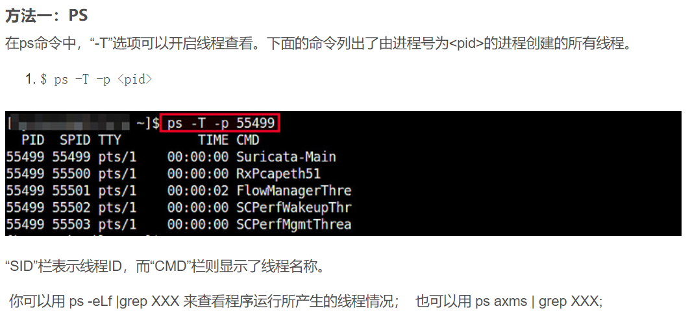
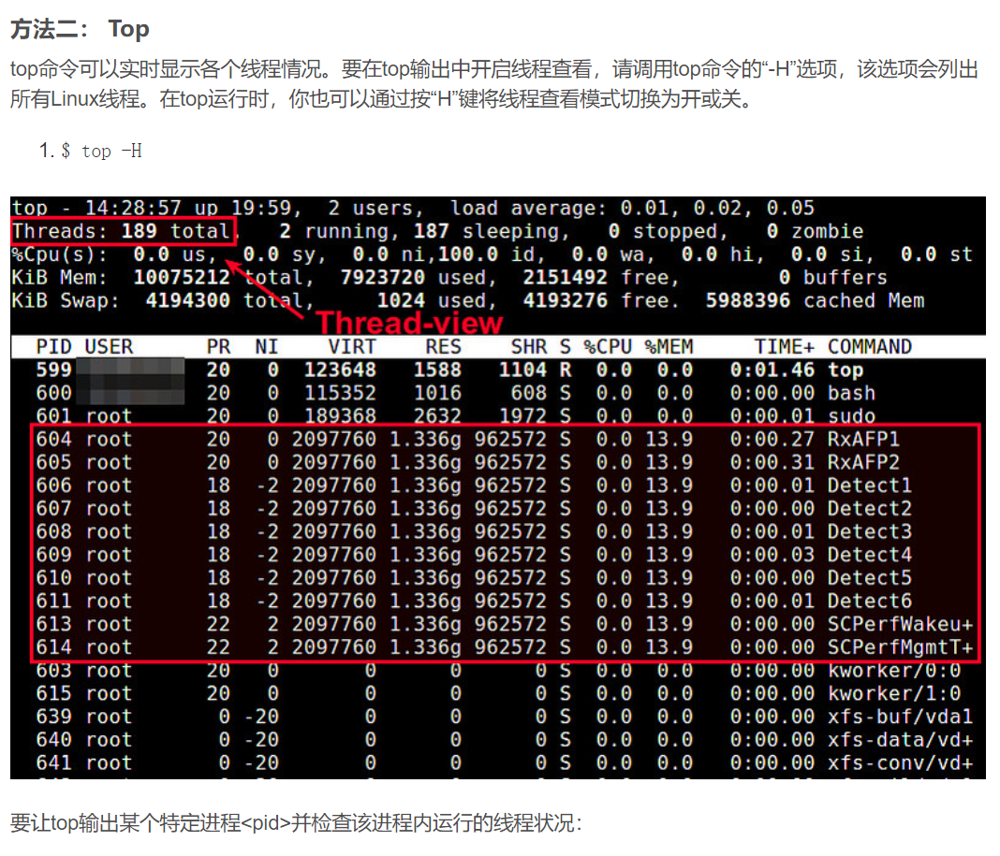

目录操作：    
    cd 切换目录
    ls/ll 查看目录
    mkdir 创建目录
    echo 输出信息
    cat 查看文件
    chown 改变文件所属用户
    chgrp 改变文件所属组
    wget 下载文件
    grep 查找某个字段  
    wc 统计文本中行数、字数、字符数
    more/less 部分显示
    find / -name 'auto.cnf' 查找文件
    cp 复制文件
    移动/重命名  mv
    pwd 显示当前目录
查看线程：
    ps
    top
    
