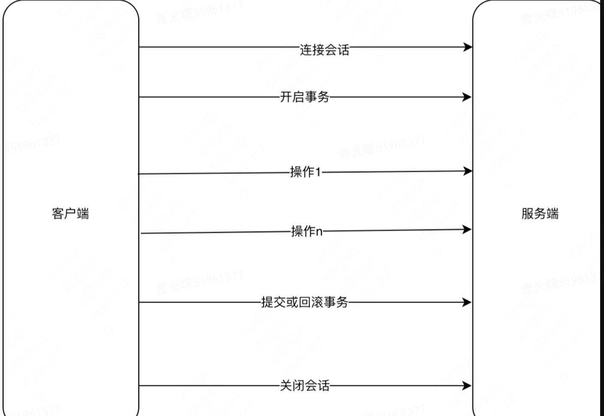
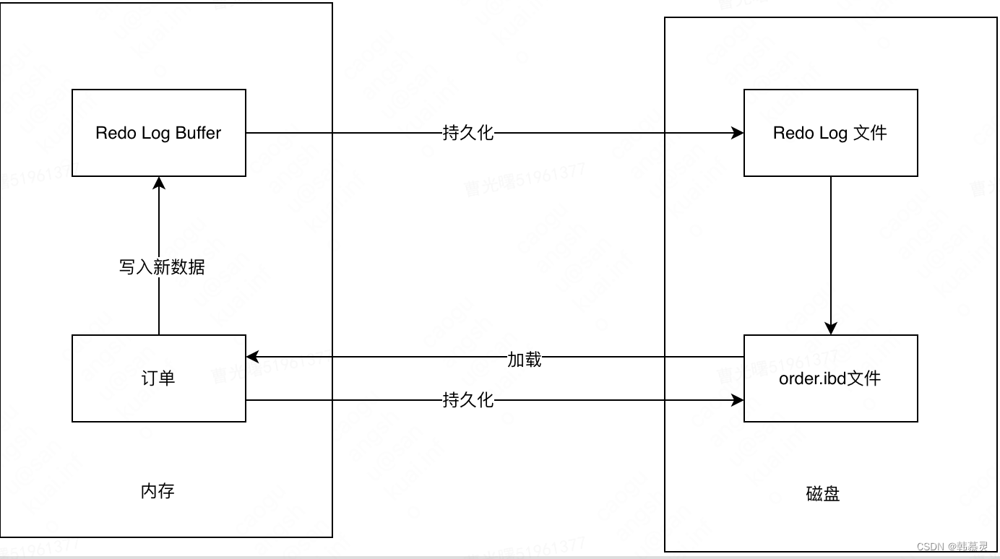
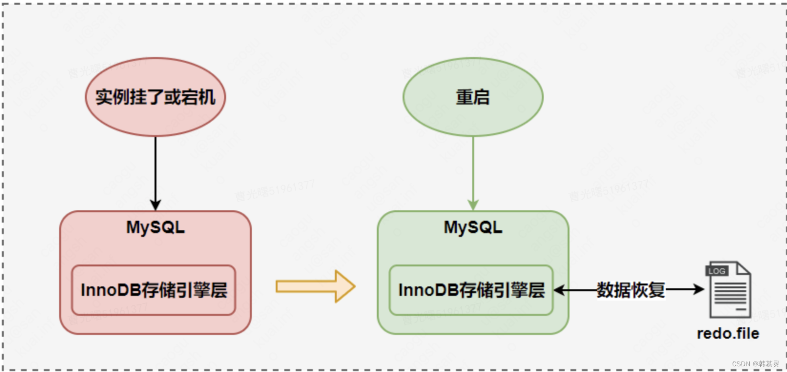

最左索引原则：
    最左优先，以最左边的为起点任何连续的索引都能匹配上。同时遇到范围查询(>、<、between、like)就会停止匹配
    例如：如果有依次A、B、C三个索引由左到右，那么在联合查询的时候如果没有添加A的时候则会全表扫描导致索引失效。
MySQL的隔离级别：
    读未提交：一个事务还没提交时，它修改的数据都可以被别的事物看到；
    读已提交：一个事务提交之后，它修改的数据才会被别的事物看到。
    可重复读：一个事务执行过程中看到的数据，总是和这个事务开启时看到的数据是一致的。
            在可重复读的隔离级别下，未提交的事务对其他事务也是不可见的。
    串行化：数据的读和写都会加锁，读会加读锁，写会加写锁。当遇到读写锁冲突时，
          后访问的事务必须等前一个事务执行完成后，再继续执行。
MySQL的四大特性(ACID)：
    原子性：语句要么全执行，要么全不执行，是事务最核心的特性，事务本身就是以原子性来定义的，实现主要基于undo log；
    持久性：保证事务提交后不会因为宕机等原因导致数据丢失，实现主要基于redo log；
    隔离性：保证事务执行尽可能不受其他事务影响；InnoDB默认的隔离级别是RR，RR的实现主要基于锁机制
    一致性：事务追求的最终目标，一致性的实现既需要数据库层面的保障，也需要应用层面的保障
MySQL的事务执行顺序：
    客户端->服务端：
        
    RedoLog （重做日志）实现原子性和持久性，RedoLog 保证了mysql的事务的原子性和持久性，
    redolog 主要记录物理日志，也就是说，对磁盘的数据进行的修改操作.
        
    redo的刷盘规则：
        1) 开启事务，发出提交事务指令后是否刷新日志，由变量 innodb_flush_log_at_trx_commit 决定
        2）每秒钟刷新一次，刷新日志频率由 innodb_flush_log_at_timeout 值 决定，默认1s.
        3) 当事务存在checkpoint 的时候，在一定程度上代表了刷鞋到磁盘的日志所处的LSN的位置。其中LSN(Log sequence Number) 标识日志的逻辑序列号。
           刷新Redo 日志的方式由innodb_flush_log_at_trx_commit 决定的
           
    C.UndoLog 实现一致性
    Undo Log 给mysql的mvcc 提供了支持， Undo log 主要做用是当事务回滚时用于将数据恢复到修改前的样子。提供的日志记录是和当前执行的sql语句语义相反的日志。
    Undo Log 在mysql中主要起到了两方面的作用: 回滚事务，以及多版本的并发事务，为MVCC提供支持。
    Undo Log 在事务开始之前产生，当事务提交的时候，并不会立刻的删除相应的Undo Log,此时，InnoDB 储存引擎会将当前事务对应的UnDolog 放入待删除的列表，接下来通过后台线程 purge thread 进行删除处理。
    d.MVCC 实现隔离性
分布式事务CAP理论：
    Consistency：一致性；在分布式系统中的所有数据备份，在同一时刻是否同样的值
    Availability：可用性；保证每个请求不管成功或者失败都有响应。
    Partition tolerance：分区容错性。系统中任意信息的丢失或失败不会影响系统的继续运作。
    CAP理论是指在一个分布式系统中CAP三者无法全部满足只能同时选择两个：例如Oracle和MySQL是CA模型；HBase是CP模型等；
sql三大范式：
    第一范式：也就是数据库的原子性，不可再分解；(确保每列保持原子性)
    第二范式：对记录的唯一性，要求记录有唯一标识，即实体的唯一性，即不存在部分依赖；(确保表中的每列都和主键相关)
    第三范式：对字段的冗余性，要求任何字段不能由其他字段派生出来，它要求字段没有冗余，即不存在传递依赖。(确保每列都和主键列直接相关,而不是间接相关)
索引（可以增加查询效率 参考链接：https://www.yisu.com/zixun/4448.html）：
    普通索引：没有任何限制，允许在定义索引的列中插入重复值和空值；index
    唯一索引：为了避免数据出现重复，列的值必须唯一，允许有空值。如果是组合索引，则列值的组合必须唯一；UNIQUE
    空间索引：是对空间数据类型的字段建立的索引，空间索引主要用于地理空间数据类型 GEOMETRY，必须将其声明为 NOT NULL；SPATIAL
    全文索引：允许在索引列中插入重复值和空值，消耗时间和硬盘空间，适合大型数据的表创建；FULLTEXT
    复合索引
索引失效场景：
    1.组合索引不满足最左索引原则；
    2.like %*这种查询方式
    3.WHERE 子句中的 OR语句，只要有条件列不是索引列
join的使用：
    主要用来连接两张表或者多张表一起查询；
    INNER JOIN：如果表中有至少一个匹配，则返回行
    LEFT JOIN：即使右表中没有匹配，也从左表返回所有的行
    RIGHT JOIN：即使左表中没有匹配，也从右表返回所有的行
    FULL JOIN：只要其中一个表中存在匹配，则返回行
SQL优化：
    1.避免使用 select *；
    2.用union all代替union：union all可以直接获取包含重复数据的所有数据；union则不会获取重复数据；
    3.小表驱动大表：假如有order和user两张表，其中order表有10000条数据，而user表有100条数据，
    可以使用in关键字实现：select 字段,字段,字段,字段 from order where user_id in (select id from user where status=1)，in 适用于左边大表，右边小表
    也可以使用exists关键字实现：select  字段,字段,字段,字段 字段,字段,字段,字段 字段,字段,字段,字段 from order，exists 适用于左边小表，右边大表。
    where exists
    (select 1 from user where order.user_id = user.id and status=1)
    4.批量操作：原sql：insert into order(id,code,user_id)  values(123,'001',100)，优化后：insert into order(id,code,user_id)  values(123,'001',100),(124,'002',100),(125,'003',101);
    5.查询中多用limit：
    6.in中值太多：在sql中对数据用limit做限制；
    7.高效的分页：原sql：select id,name,age  from user limit 10,20; 优化后：select id,name,age  from user where id > 1000000 limit 20;
    （也可使用between，但是between要在唯一索引上分页，不然会出现每页大小不一致的问题）；
    8.用连接查询代替子查询；
    9.索引优化：可以使用explain命令，查看mysql的执行计划。
分页查询：pagInfo,ROWNUMBER关键字。(MP分页插件，数据库查询分页使用limit)