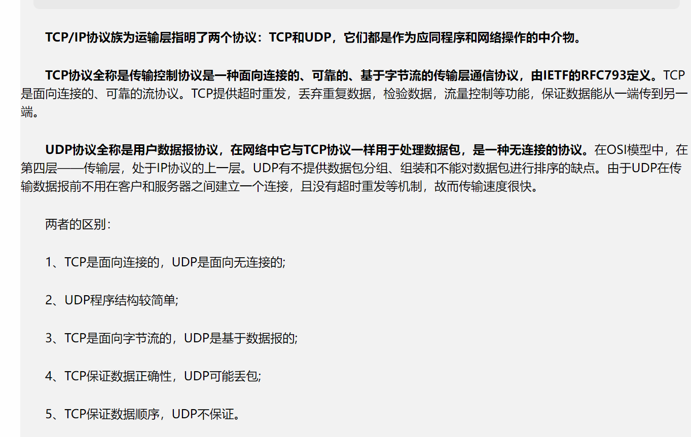
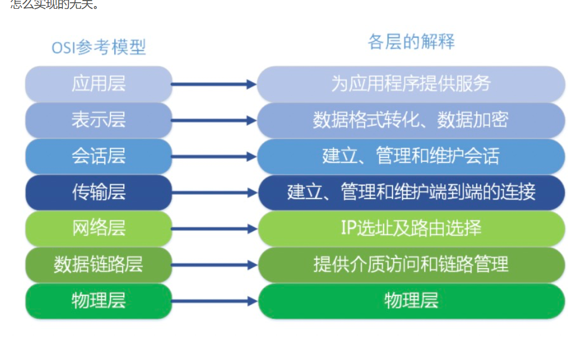
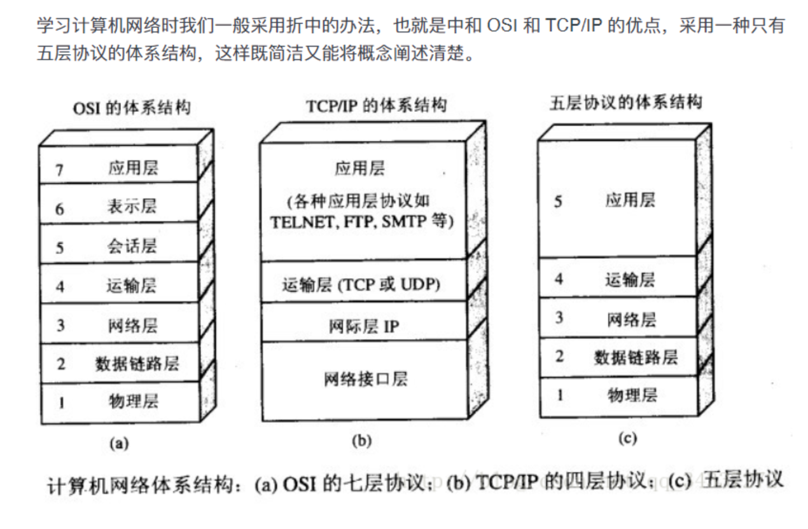

一、
二、OSI七层网络模型：
    应用层:最靠近用户的一层，是为计算机用户提供应用接口，也为用户直接提供各种网络服务。
          数据传输基本单位：报文（数据）;
    包含的主要协议：HTTP（超文本传输协议）、HTTPS（安全超文本传输协议）、FTP（文件传输协议）、
    TFTP（简单文件传输协议）、SMTP（可靠且有效的电子邮件传输的协议）、DNS（域名解析协议）、Telnet（远程登录服务的标准协议）、
    POP3（邮局协议）、DHCP（动态主机配置协议）、SNMP（一般指简单网络管理协议）
    表示层:表示层对上层数据或信息进行变换以保证一个主机应用层信息可以被另一个主机的应用程序理解。表示层的数据转换包括数据的 加密 
    、 压缩 、 格式转换 等。
    数据的表示、安全、压缩。（在五层模型里面已经合并到了应用层）
    格式有，JPEG、ASCll、EBCDIC、加密格式等.
    会话层:会话层管理主机之间的会话进程，即负责建立、管理、终止进程之间的会话。会话层还利用在数据中插入校验点来实现数据的同步。
    （在五层模型里面已经合并到了应用层）;
    传输层:传输层的单元：数据段,传输层负责将上层数据分段并提供端到端的、可靠的或不可靠的传输以及端到端的差错控制和流量控制问题；
    包含的主要协议：TCP 协议（Transmission Control Protocol，传输控制协议）、UDP 协议（User Datagram Protocol，用户
    数据报协议）；
    第一个端到端，即主机到主机的层次。传输层负责将上层数据分段并提供端到端的、可靠的或不可靠的传输。此外，传输层还要处理端到端的差错控制
    和流量控制问题。 传输层的任务是根据通信子网的特性，最佳的利用网络资源，为两个端系统的会话层之间，提供建立、维护和取消传输连接的功能，
    负责端到端的可靠数据传输。在这一层，信息传送的协议数据单元称为段或报文。 网络层只是根据网络地址将源结点发出的数据包传送到目的结点，而
    传输层则负责将数据可靠地传送到相应的端口。
    网络层:基本数据单位为：IP数据报（数据包）；
    IP协议（Internet Protocol，因特网互联协议）;
    ICMP协议（Internet Control Message Protocol，因特网控制报文协议IPV4 IPV6）;
    ARP协议（Address Resolution Protocol，地址解析协议）;
    RARP协议（Reverse Address Resolution Protocol，逆地址解析协议）。
    重要的设备：路由器。
          网络层负责对子网间的数据包进行路由选择。此外，网络层还可以实现拥塞控制、网际互连等功能.
    网络层中涉及众多的协议，其中包括最重要的协议，也是TCP/IP的核心协议——IP协议。IP协议非常简单，仅仅提供不可靠、无连接的传送服务。IP协
    议的主要功能有：无连接数据报传输、数据报路由选择和差错控制。与IP协议配套使用实现其功能的还有地址解析协议ARP、逆地址解析协议RARP、因特
    网报文协议ICMP、因特网组管理协议IGMP.
    数据链路层（Data Link Layer）:数据链路层为网络层提供可靠的数据传输；
                            基本数据单位为：帧；
                            主要的协议：以太网协议；
                            两个重要设备名称：网桥和交换机。
    物理层（Physical Layer）:传输单位：bit（比特）
    该层为上层协议提供了一个传输数据的可靠的物理媒体。简单的说，物理层确保原始的数据可在各种物理媒体上传输。常用设备有（各种物理设备）集线器、中继
    器、调制解调器、网线、双绞线、同轴电缆。这些都是物理层的传输介质。原始比特流的传输

    

    